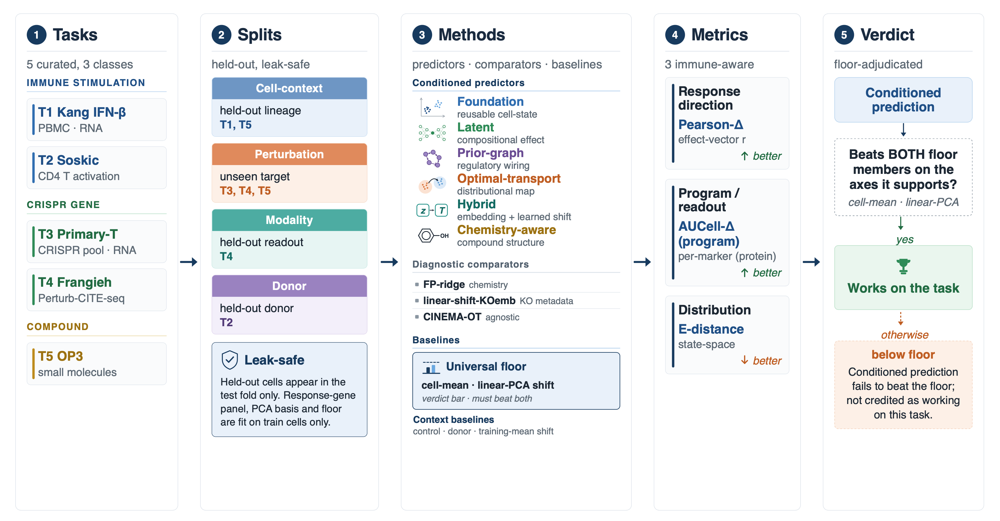

# ivcbench

An immune-aware benchmark of perturbation-prediction generalization across cell context, unseen
perturbations, unseen donors, and readout modality.

ivcbench accompanies **Toward Immune Virtual Cells: An Immune-Aware Benchmark of Perturbation-Prediction
Generalization** (Chanhee Lee, Jae Yong Ryu). It holds the benchmark code, the deposited result tables, and
the figure scripts. It evaluates existing perturbation-prediction models in immune single-cell settings and
introduces no new model of its own.

[](LICENSE)

[](https://doi.org/10.5281/zenodo.20756042)

Each axis is a generalization question that recurs in immune perturbation studies. Models are scored against
simple pre-specified baselines, including a two-member "floor" that drives the main pass/fail interpretation.



## Main results

The main benchmark contains 35 model-by-task cells across five task clusters. The headline tables are:

- [`results/_paper/cross_cluster_headline.csv`](results/_paper/cross_cluster_headline.csv)
- [`results/_paper/cross_cluster_headline.md`](results/_paper/cross_cluster_headline.md)
- [`results/_paper/descriptive_fit_matrix.csv`](results/_paper/descriptive_fit_matrix.csv)

Most conditioned models clear neither simple floor baseline. Two model-by-task cells do: CellOT on the
Soskic donor-held-out task and an FP-ridge chemistry prior on the OP3 cell-context task. The CellOT effect is
largest on the donor axis; the FP-ridge result is a model-level observation and does not survive all
multiplicity corrections.

For unseen perturbations, the benchmark is largely negative. No method clears the floor on the unseen-gene
CRISPR tasks, explicit chemistry conditioning does not rescue the unseen-compound setting, and most
multi-dimensional immune programs do not transfer cleanly across contexts. The type-I interferon result is
treated separately because it is close to a coarse mean-shift response.

Three external or partially independent settings round out the release: a leave-one-cytokine analysis on the
Human Cytokine Dictionary summary table, the Chen FOXP3 Perturb-icCITE-seq checkpoint replication, and a
CellOT donor learning curve on the Soskic dataset. These corroborate the main results and document
provenance; they are not additional submitted supplementary figures.

## Reproducing the benchmark results

The release is built around one reproduction claim. The paper's main results (the 35-cell Pearson-Δ
headline census and the floor-clearance verdicts behind the conclusions) are recomputed from the
deposited prediction bundles by a single containerized, GPU-free run, with no conda, no GPU, and no raw
single-cell data. The figure-to-script map, the per-family environment table, the `$IVCBENCH_*`
variables, and the per-model commands live in [`REPRODUCE.md`](REPRODUCE.md); this section is the entry
point. `docker` works in place of `podman`.

```bash
podman build -t ivcbench . && podman run --rm ivcbench    # docker works in place of podman
```

The run re-scores every deposited prediction bundle, reassembles the 35-cell headline, and checks it
against the committed paper numbers, printing `DEPOSIT CONSISTENCY: PASS` when the two agree. Because the
census is assembled from the very bundles being re-scored, each cell reproduces exactly rather than to
within a tolerance (the donor CellOT macro of 0.3666 and the OP3 FP-ridge cell-context result of 0.3874
among them); `predictions/COVERAGE.md` is the cell-by-cell account. Without a container, install the core
environment (`pip install -e .` against `requirements.txt`) and run `make reproduce`, which re-scores the
bundles and runs the same consistency gate; `make test` adds the leak audit and the smoke tests.

**Scope of the reproduction.**

- **Reproduced (one GPU-free run):** the 35-cell response-direction Pearson-Δ headline census, the
  floor-clearance verdicts, and the main positive and negative conclusions, checked against the committed
  numbers by the consistency gate.
- **Rebuilt from deposited result files:** every manuscript figure and Supplementary Table, via the
  scripts under `scripts/` (see [`REPRODUCE.md`](REPRODUCE.md)).
- **Provided for provenance:** the raw-data accessions and download scripts, the leak-safe split builder
  and auditor, the per-model runners, the per-family environment table, and the training manifest:
  everything needed to regenerate the prediction bundles by retraining, documented but not offered as a
  one-command reproduction.
- **Outside the GPU-free path:** the corroborating distributional energy-distance metric (Supplementary
  Table S12). The deposited bundles are compact per-stratum means and energy distance needs the per-cell
  prediction cloud, so `reproduce-eval` leaves its `e_distance` column empty by design
  (`predictions/COVERAGE.md`); that axis is regenerated by re-dumping per-cell bundles through the
  retraining path.

### Regenerating the prediction bundles by retraining (provenance)

Retraining the external models from raw data is documented for provenance, not offered as a one-command
path. It needs the raw datasets (two of which are access-controlled), a GPU, and the per-family conda
environments (the upstream implementations carry conflicting CUDA/PyTorch versions, so each model family
runs in its own environment), and the trained models reproduce their reported Pearson-Δ only to within
run-to-run variation. `make train MODEL=<name>` retrains and re-scores a single model (runnable names and
exact commands in [`scripts/train_manifest.csv`](scripts/train_manifest.csv)); `make data` fetches the
public datasets (`--list` previews the plan; the two access-controlled datasets are flagged for manual
login/DAC); and `make reproduce-all` chains the whole retraining path on a host that has every
environment and dataset in place. A unit whose environment or data is missing is reported as a clean skip
naming what to set, not a crash. The per-family environments and the bundled training image are described
in [`REPRODUCE.md`](REPRODUCE.md).

## What's in the repository

| Path | Contents |
|------|----------|
| `src/ivcbench/` | Core package: schemas, loaders, split construction, leak audit, baseline registry, metrics, statistics, and runners. |
| `scripts/` | Figure scripts, table assembly, model-family runners, the retraining driver, and dataset download scripts. |
| `results/` | Deposited paper-level result tables and generated figure files. Raw data and model checkpoints are not included. |
| `predictions/` | The deposited prediction bundles and their format; what `make reproduce-eval` re-scores. |
| `data/README.md` | Dataset accessions, access notes, and the download scripts. |
| `REPRODUCE.md` | Reproduction detail: the figure/table-to-script map, the per-family environment table, and the retraining manifest. |

Each benchmark run loads a dataset, builds the task split (held-out lineage, donor, gene, or compound), runs
the leak audit, applies the model-applicability registry, fits each model on the training fold only, scores
response-direction, distributional, and immune-program metrics, and bootstraps uncertainty over the biological
unit of the task rather than over technical seeds. The corresponding modules are `src/ivcbench/splits/`,
`baselines/`, `metrics/`, and `clusters/`. Raw single-cell objects, checkpoints, and local environments stay
out of the release, so you can inspect the reported analyses without re-running the GPU-heavy training.

## Data

Raw data are not distributed here. `make data` fetches every public dataset in one command (`--list` previews
the plan); the two access-controlled datasets are flagged for manual login/DAC. Accessions, access notes, and
the per-dataset scripts are in [`data/README.md`](data/README.md) and [`scripts/datasets.csv`](scripts/datasets.csv).

| Dataset | Accession / DOI | Notes |
|---|---|---|
| Kang 2018 PBMC IFN-beta | GEO `GSE96583` | Public GEO data. |
| Soskic CD4+ activation | raw `EGAD00001008197`; processed trynkalab h5ad | Used for the donor-held-out task. |
| Shifrut primary-T KO | GEO `GSE119450` | Public GEO data. |
| Schmidt primary-T CRISPRa | GEO `GSE190604` | Public GEO data. |
| McCutcheon primary-T CRISPRi/a | GEO `GSE218985` | Public GEO data. |
| Chen FOXP3 Perturb-icCITE-seq | DDBJ `PRJDB16517` / GEA `E-GEAD-648` | Controlled/login access; see `data/README.md`. |
| Human Cytokine Dictionary | Parse + Allen / theislab summary table | Used for the leave-one-cytokine analysis. |
| Frangieh Perturb-CITE-seq | Zenodo `10.5281/zenodo.13350497` | Tumour-cell checkpoint analysis. |
| McCarthy/OP3 PBMC chemical perturbation | GEO `GSE279945` | Chemical perturbation task. |

## Citation

```bibtex
@unpublished{Lee2026ImmuneVirtualCell,
  title  = {Toward Immune Virtual Cells: An Immune-Aware Benchmark of Perturbation-Prediction Generalization},
  author = {Lee, Chanhee and Ryu, Jae Yong},
  year   = {2026},
  note   = {Manuscript under review}
}

@software{ivcbench,
  title     = {ivcbench: An Immune-Aware Benchmark of Perturbation-Prediction Generalization},
  author    = {Lee, Chanhee and Ryu, Jae Yong},
  year      = {2026},
  version   = {1.1.1},
  doi       = {10.5281/zenodo.20756042},
  publisher = {Zenodo}
}
```

GitHub also reads citation metadata from [`CITATION.cff`](CITATION.cff).

## License

The code in this repository is released under the [MIT license](LICENSE). Dataset-specific terms remain with
the original data providers; see [`data/README.md`](data/README.md).

## Funding

This work was supported by the G-LAMP Program of the National Research Foundation of Korea (NRF), funded by
the Ministry of Education (No. RS-2025-25441317).

This work was supported by the Korea Health Industry Development Institute (KHIDI), funded by the Ministry of
Health and Welfare, Republic of Korea (No. RS-2025-25459520).

This research was funded by the National Research Foundation of Korea (NRF) grants funded by the Korean
Government (MSIT; grant no. RS-2025-02304296).
