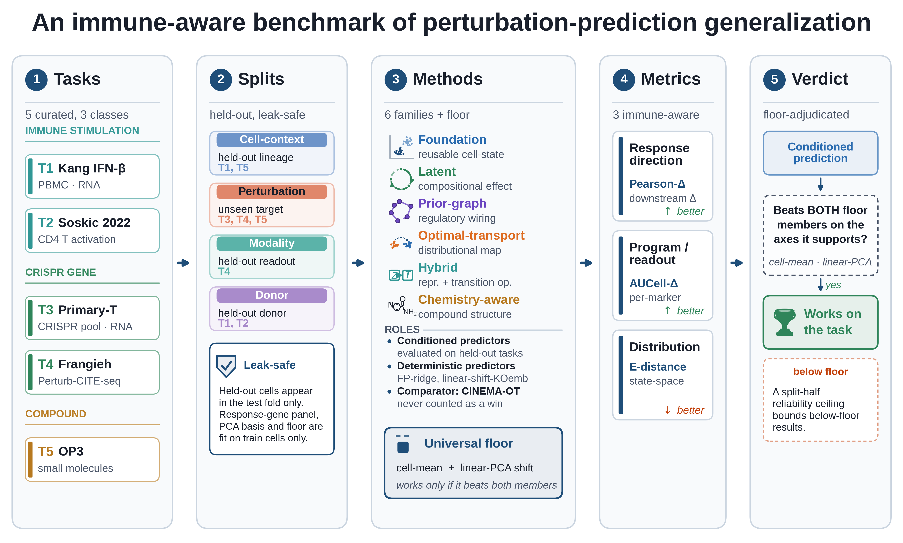

<h1 align="center">ivcbench</h1>
<h3 align="center">An Immune-Aware Benchmark of Perturbation-Prediction Generalization</h3>

<p align="center">
  <a href="LICENSE"></a>
  
  <a href="https://doi.org/10.5281/zenodo.XXXXXXX"></a>
  
</p>

<p align="center">
  Code, deposited result tables, and figure scripts for<br>
  <b>"Toward Immune Virtual Cells: An Immune-Aware Benchmark of Perturbation-Prediction Generalization"</b><br>
  Chanhee Lee &amp; Jae Yong Ryu
</p>

<p align="center">
  
</p>

This repository evaluates whether perturbation-prediction models (foundation, latent/compositional,
prior-graph, optimal-transport, and hybrid families) **generalize across the axes that matter for
immunology** — cell-context transfer, unseen perturbations, unseen donors, and readout modality — and
whether they beat a set of pre-registered simple baselines (the *universal floor*). **The contribution is
evaluation methodology, not a new model.**

<sub>The deposited result tables under [`results/`](results/) reproduce **every** figure and supplementary
table **without** downloading raw data or re-running any model.</sub>

---

## Contents

- [Headline finding](#headline-finding)
- [What this repository provides](#what-this-repository-provides)
- [Install](#install)
- [Quickstart (GPU-free core)](#quickstart-gpu-free-core)
- [Benchmark recipe (the pipeline)](#benchmark-recipe-the-pipeline)
- [Data availability](#data-availability)
- [Reproducing each figure / table](#reproducing-each-figure--table)
- [Citation](#citation)
- [License](#license)

---

## Headline finding

1. **Conditioning rarely beats simple baselines.** Across 35 model-by-task cells (32 conditioned + 3
   CINEMA-OT comparators), only **two conditioned cells** beat both floor members: CellOT on the Soskic
   donor axis and an FP-ridge chemistry prior on OP3 cell-context.
2. **Where it helps, it helps with cell/donor *context*, not unseen biology.** CellOT crosses the donor
   barrier (+0.102 Pearson-Δ over the cell-mean baseline, 93/106 donors, paired Wilcoxon p = 4.7×10⁻¹⁴);
   the win is **model-level, not family-level** (its family-mate scPRAM loses to CellOT in 105/106 donors).
3. **Unseen perturbations and immune programs are a blind spot.** No method beats the floor on unseen-gene
   CRISPR (0/15 cells), explicit chemistry conditioning collapses on unseen compounds (chemCPA), and every
   multi-dimensional immune program fails to transfer — type-I interferon survives only because it reduces
   to a coarse mean shift.

**New-data corroboration.** Three independent datasets reproduce the same law: an unseen-cytokine LOCO on the
Human Cytokine Dictionary shows the regime split (annotation-only "novel" cytokines stay at/below the floor,
cytokines seen in other celltypes transfer above it), an n = 2 surface-readout replication on the Chen FOXP3
Perturb-icCITE-seq data (E-GEAD-648) reproduces the modality finding, and a CellOT donor learning curve on
Soskic shows how the donor-axis win scales with training-donor count.

**At-a-glance results table:** [`results/_paper/cross_cluster_headline.csv`](results/_paper/cross_cluster_headline.csv)
(human-readable: [`cross_cluster_headline.md`](results/_paper/cross_cluster_headline.md)); the per-task
fit verdicts are in [`results/_paper/descriptive_fit_matrix.csv`](results/_paper/descriptive_fit_matrix.csv).

---

## What this repository provides

| Path | Contents |
|------|----------|
| **`src/ivcbench/`** | GPU-free benchmark core: data schema + real-data loaders, leak-proof split builder + **leak auditor** (the hard gate), applicability registry, the metric suite (response, distribution, program, robustness, stats), and the runner. |
| **`scripts/`** | Figure-generation scripts (main + supplementary), the analysis scripts that compute the deposited derived tables, per-family model runners, and the dataset **download scripts** (`download_*.sh`, `datasets.csv`). Raw-data *artifacts* are not shipped; only the scripts that fetch them. |
| **`results/`** | The **deposited paper-level result tables** (CSV/JSON) and the backing figure PNG/PDFs (per-cluster `C1`–`C5`, the `_paper` plate, and `newdata/` for the corroboration analyses). No raw data, checkpoints, or logs (~13 MB). |
| **`data/README.md`** | Every dataset with its accession/DOI and the script that downloads/preprocesses it. |

**Not shipped** (see `.gitignore`): raw `*.h5ad`/`*.npz` data, model checkpoints, the `.venv`, per-seed
prediction arrays, and the manuscript `.docx`. The full working tree is ~172 GB; this release is tens of MB.

---

## Install

The split/audit/metric core and all figure/analysis scripts run in a single lightweight environment.

```bash
# conda
conda env create -f environment.yml      # creates env "ivc" (python 3.13)
conda activate ivc
pip install -e .                          # editable install of the ivcbench package

# or pure pip
python -m venv .venv && . .venv/bin/activate
pip install -r requirements.txt
pip install -e .
```

Heavy per-family baselines (scGPT, GEARS/AttentionPert, CPA/chemCPA, STATE, CellOT, scPRAM) have
**conflicting torch/python pins** and are run in their own conda environments; their runners under
`scripts/` shell out and read paths from environment variables (`IVCBENCH_*`). The deposited result
tables under `results/` let you regenerate every figure **without** re-running any model.

## Quickstart (GPU-free core)

```bash
make setup    # .venv + editable install (core deps only)
make test     # leak auditor + C5 smoke pipeline
make pilot    # C5 single-pass on a synthetic OP3-shaped fixture -> results table
```

Reproduce a figure straight from the deposited tables:

```bash
python scripts/make_figure2_landscape_verdict.py  # -> results/_paper/figure2_landscape_verdict.{png,pdf,tiff}
python scripts/figure_framework.py                # Figure 1 (framework)
python scripts/figure_immune_blindspot.py         # immune blind-spot map
```

---

## Benchmark recipe (the pipeline)

```
 inputs (real or synthetic single-cell perturbation data)
   │
   ▼
 build leak-proof split  (splits/builder.py — leave-one-lineage/donor/gene/compound-out)
   │
   ▼
 LEAK AUDIT  (splits/audit.py — HARD GATE; nothing scores until it passes)
   │
   ▼
 applicability gate  (baselines/registry.py — run each family only on tasks its representation claims;
                      skip not_defined / inapplicable cells)
   │
   ▼
 per-fold fitting  (train on the held-out fold's TRAIN cells only: train-fold response genes + a
                    train-fold PCA basis; no held-out information enters fitting)
   │
   ▼
 universal-floor baselines  (the universal two-member floor is {cell-mean shift, linear-PCA shift} and a
                             model must beat BOTH members to have delivered; donor shift and training-mean
                             shift are descriptive context comparators, not universal-floor members)
   │
   ▼
 three immune-aware metrics  (response-direction Pearson-Δ · distributional E-distance · immune-program
                              AUCell-Δ)   [metrics/response.py · distribution.py · program.py]
   │
   ▼
 cluster-bootstrap CIs + multiplicity control  (bootstrap over the biological unit — lineage / dataset /
                              donor — never over seeds; Wilcoxon signed-rank; BH + Holm)  [metrics/stats.py]
   │
   ▼
 output tables  (results/<cluster>/results_raw.csv  ->  results/_paper/*.csv/json  ->  figures)
```

Seeds are collapsed to technical repeats **within** a biological unit and never enter the bootstrap as
independent observations. See `src/ivcbench/` and the per-cluster modules `clusters/c1..c5.py`.

---

## Data availability

All datasets are **public or access-controlled deposits**; raw data are **downloaded via the scripts in
`scripts/`, not shipped** in this repository. Accessions/DOIs and the responsible script for each dataset
are listed in [`data/README.md`](data/README.md) and machine-readable in
[`scripts/datasets.csv`](scripts/datasets.csv). Headline anchors:

| Dataset | Accession / DOI | Download script |
|---|---|---|
| Kang 2018 PBMC IFN-β | GEO **GSE96583** | `scripts/download_kang.sh`, `download_public.sh` |
| Soskic CD4⁺ activation (106-donor LODO) | trynkalab processed h5ad; raw **EGAD00001008197** | `scripts/download_soskic.sh` |
| Shifrut primary-T KO | GEO **GSE119450** | `scripts/download_public.sh` |
| Schmidt primary-T CRISPRa | GEO **GSE190604** | `scripts/download_public.sh` |
| McCutcheon primary-T CRISPRi/a | GEO **GSE218985** | `scripts/download_public.sh` |
| Chen FOXP3 Perturb-icCITE-seq (checkpoint replication) | DDBJ **PRJDB16517** / GEA **E-GEAD-648** | (login; see `data/README.md`) |
| Human Cytokine Dictionary summary table (unseen-cytokine LOCO) | Parse + Allen `theislab/HumanCytokineDict` (bioRxiv 2025.12.12.693897) | portal; `data/human_cytokine_dict/hcd_mini.csv` |
| Frangieh Perturb-CITE-seq (tumour) | scPerturb Zenodo **10.5281/zenodo.13350497** | (Zenodo; see `data/README.md`) |
| McCarthy/OP3 PBMC chemical perturbation | GEO **GSE279945** | `scripts/download_op3.sh` |

The deposited result tables in `results/` are sufficient to reproduce every figure and supplementary table
**without** downloading any raw data.

---

## Reproducing each figure / table

See **[`REPRODUCE.md`](REPRODUCE.md)** for the full table mapping every main figure, supplementary figure,
and Supplementary Table (S1, S2a, S2b, S3–S12) to the exact script under `scripts/` that generates it and
the deposited result file it reads.

---

## Citation

If you use this benchmark, please cite the article and the archived code:

```bibtex
@unpublished{Lee2026ImmuneVirtualCell,
  title  = {Toward Immune Virtual Cells: An Immune-Aware Benchmark of Perturbation-Prediction Generalization},
  author = {Lee, Chanhee and Ryu, Jae Yong},
  year   = {2026},
  note   = {Manuscript under review}
}

@software{ivcbench,
  title     = {ivcbench: An Immune-Aware Benchmark of Perturbation-Prediction Generalization},
  author    = {Lee, Chanhee and Ryu, Jae Yong},
  year      = {2026},
  version   = {1.0.1},
  doi       = {10.5281/zenodo.XXXXXXX},
  publisher = {Zenodo}
}
```

GitHub also offers a "Cite this repository" button from [`CITATION.cff`](CITATION.cff).

## License

[MIT](LICENSE). Each third-party dataset retains its own license/terms; see [`data/README.md`](data/README.md).

## Funding

This research was supported by the G-LAMP Program of the National Research Foundation of Korea (NRF) grant
funded by the Ministry of Education (No. RS-2025-25441317).
