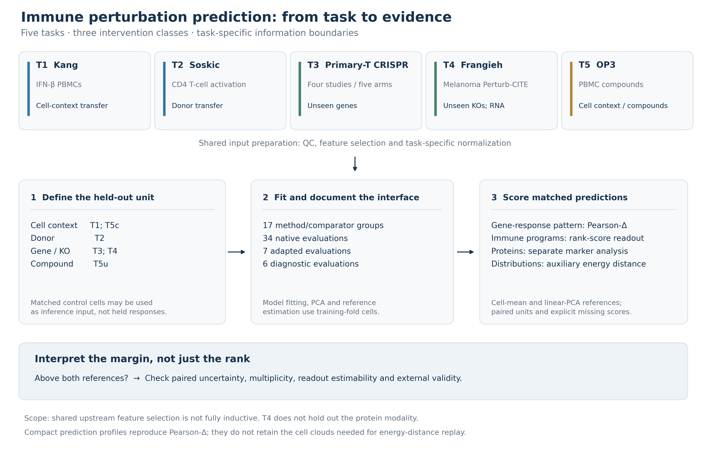

# ivcbench

Revision package v1.2.5 for **Toward Immune Virtual Cells: An Immune-Aware Benchmark of Perturbation-Prediction Generalization**, by Chanhee Lee and Jae Yong Ryu (BIB-26-1553).

[](LICENSE)

[](https://doi.org/10.5281/zenodo.20756042)



This is an evaluation of existing methods, not a new prediction model. The final panel contains **58 model-by-task evaluations: 46 native, eight adapted and four diagnostic**, spanning 16 of the 17 method/comparator groups surveyed. The six reported settings have 9 / 9 / 10 / 10 / 11 / 9 entries for T1 / T2 / T3 / T4 / T5c / T5u.

| Setting | Held-out axis |
|---|---|
| T1 | Cell lineage, Kang IFN-β |
| T2 | Donor, Soskic CD4 activation |
| T3 | Target gene, five primary-T CRISPR dataset-arms |
| T4 | Target gene, Frangieh IFNγ melanoma RNA |
| T5c | Cell lineage, OP3 seen compounds |
| T5u | Compound, OP3 |

Only native CPA/scGen executions are counted. The CPA/chemCPA T5u entry uses native chemCPA with chemical conditioning, not the old adapted CPA head. STATE's T3/T4/T5 executions were excluded after a wrong-output-file recovery audit and have since been re-run through the corrected path; STATE is native on all six settings. The audit record carries both the exclusion and the re-run. See [EXECUTION_AUDIT.md](EXECUTION_AUDIT.md) and the machine-readable interface records.

## Reproduce without a GPU

```bash
make setup
make reproduce
make test
```

The default path re-scores the **1,401 selected mean-profile bundles** (1,149 model and 252 simple-reference inputs), then checks the 58-entry panel, 1,698 analysis-unit rows, paired targets, source hashes and uncertainty. Success prints `DEPOSIT CONSISTENCY: PASS`. Historical/reference bundles outside this panel are retained for traceability; the default manifest does not treat them as native-model evidence.

Eight point estimates exceed the task-fixed stronger cell-mean/linear-PCA reference, seven of them conditioned predictors and the eighth the FP-ridge diagnostic. Only CellOT T2 has a positive margin supported by the conditional interval and the 27-comparison BH/Holm family. The seven other positive estimates remain descriptive or uncertain. No conditioned method clears the task-level reference with interval support on unseen genes, on the modality split or on unseen compounds; the one positive estimate on an unseen-perturbation axis, scFoundation on unseen compounds, has an interval spanning zero. These are results for the recorded implementations and inputs, not universal statements about a model family.

T2 evaluates the supplied condition-specific covariate-regressed, scaled and clipped Soskic matrices, not unregressed activation expression. Training-only additional scaling does not undo this source processing. All tasks remain conditional on shared upstream feature selection. The input audit and source-method provenance are retained in `results/_paper/soskic_input_space*`.

T3/T5c program scoring is symmetric: the same operator is applied to predicted and observed mean expression. The primary readout is the equal-weight mean-expression shift of each program's measured members, behind Figure 3b/3c and Supplementary Tables S7 and S12; the top-5% rank score it replaced is retained as a sensitivity analysis (Figure S6). `scripts/program_analysis.py` recomputes both from the deposited bundles on CPU and compares the result with `results/_paper/immune_program_revision/`. The identity predictor has zero error for all 37 targets and correlation one for the 12 variable targets. That outcome is structural, because predicted and observed profiles go through the same deterministic scorer: it confirms the scoring path is symmetric, and is not independent evidence about the scores.  22/25 T3 targets are constant, not evidence of model failure. Exact-held-target repeatability uses disjoint treated/control halves and the stored gene masks. It diagnoses cell-sampling stability, not a prediction ceiling. These corrections do not change the primary Pearson-Δ panel.

```bash
make census       # panel, analysis units and common multiplicity family
make summaries    # donor, effect-size, chemistry, program and cost summaries
make figures      # Figure 2, the supplementary readout panels and the overview diagram
make programs     # the immune-program and lineage analyses, keeping their output
```

See [REPRODUCE.md](REPRODUCE.md) for scopes and limits. Mean bundles do not retain per-cell prediction clouds or a training PCA basis; they cannot recompute energy distance. Raw-data fitting is a separate, model-environment-dependent workflow, not a one-command promise.

## Package map

| Path | Purpose |
|---|---|
| `src/ivcbench/` | Split construction, scoring, loaders and benchmark interfaces |
| `predictions/` | Mean profiles; selection documented in [COVERAGE.md](predictions/COVERAGE.md) |
| `results/_paper/` | Current panel, full-precision analytical summaries and figures |
| `results/_paper/supplementary_tables/` | **The table of record for every Supplementary Table S1-S23**, indexed by `MANIFEST.csv`. Resolve a table by its number HERE. The eight `Supplementary_Table_S<N>_*.csv` files one directory up are working artefacts from earlier numbering and several carry a number that now belongs to a different table; `results/_paper/DEPOSIT_NOTES.md` lists each collision |
| `results/_paper/immune_program_revision/` | Full-precision record behind Figure 3b-d, Figure S6 and Tables S7/S12/S22: per-unit values, program membership, support and exclusions, and the retained rank sensitivities. `scripts/program_analysis.py` and `scripts/lineage_analysis.py` recompute it |
| `results/provenance_inputs/` | Preserved scalar/timing inputs for auxiliary analyses |
| `scripts/` | Re-scoring, summaries, figures and provenance tools |
| `model_runners/` | Model-family execution interfaces; separate environments required |
| `submission/` | Document source and frozen editorial metadata, in the submission archive |
| `source_data/` | One source per final table panel, in the submission archive |
| [data/README.md](data/README.md) | Dataset accessions and access conditions |
| [ANALYSIS_SCOPE.md](ANALYSIS_SCOPE.md) | Analysis units, conditional inference and review-stage scope |

For code navigation, begin with `eval/bundle.py` for stored-profile scoring,
`scripts/census_units.py` for paired inference, `scripts/program_analysis.py` for the
mean-expression program and response analysis, and `scripts/immune_readout_audit.py` for the
retained rank scores and target validation. Raw fitting enters through
`runner/run.py` and task-specific scripts. Its `report/` outputs are diagnostic
run notes, not another manuscript; only `submission/` builds the submitted text.

Figure colors encode scientific quantities only. Clean and revision-highlighted documents use identical artwork; revision blue is confined to editable Word text, tables and captions.

Development formatting uses Black 25.1.0 with the configuration in
`pyproject.toml` (`pip install -e '.[dev]'`). Formatting does not change retained
predictions or statistical outputs. Model-family environments remain separate.

## Version and availability

This exact package accompanies the revision. Its file checksums identify the submitted snapshot. The [project repository](https://github.com/Chan-Hee/ivcbench) and [all-versions archive DOI](https://doi.org/10.5281/zenodo.20756042) also contain earlier versions; those versions do not reproduce this revised 58-entry panel. The concept DOI is not a version-specific identifier for an unpublished revision snapshot.

Please cite the manuscript and identify the package version/checksum used. Citation metadata are in [CITATION.cff](CITATION.cff). Original project code is under the [MIT license](LICENSE); this does not relicense third-party-derived material. The study-local PertAdapt extraction has separate [attribution and redistribution notes](vendor/pertadapt/README.md). Original dataset and model terms remain applicable.

## Funding

This work was supported by the G-LAMP Program of the National Research Foundation
of Korea (NRF), funded by the Ministry of Education (No. RS-2025-25441317); the
Korea Health Industry Development Institute (KHIDI), funded by the Ministry of
Health and Welfare, Republic of Korea (No. RS-2025-25459520); and the National
Research Foundation of Korea (NRF) grants funded by the Korean Government (MSIT;
grant no. RS-2025-02304296).
